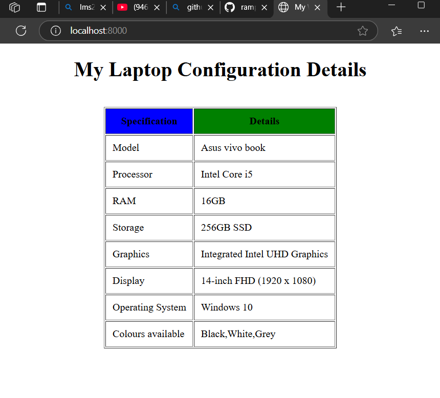
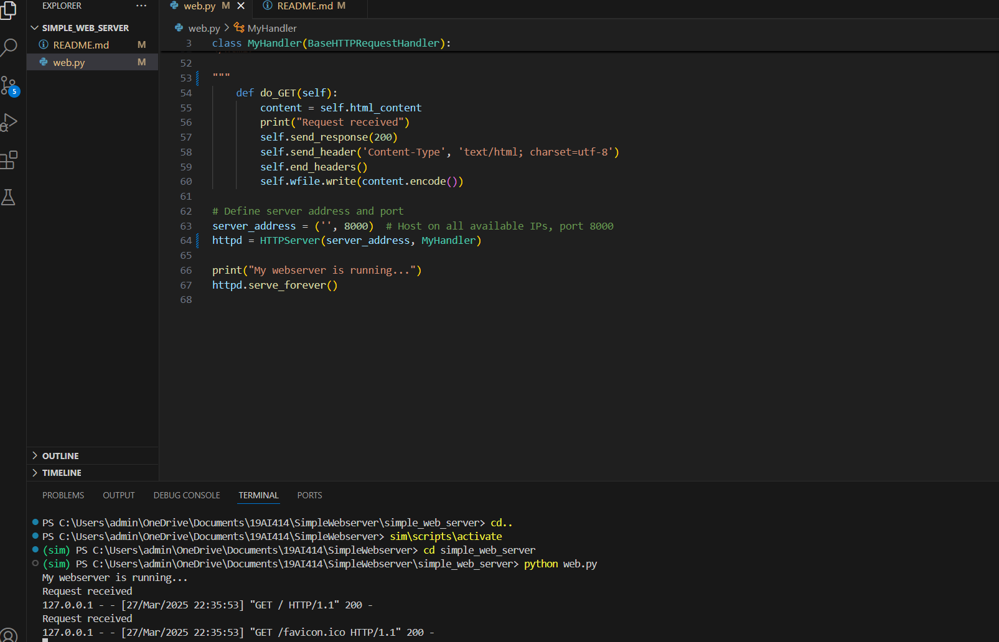

# EX01 Developing a Simple Webserver

# Date:
# AIM:
To develop a simple webserver to serve html pages and display the configuration details of laptop.

# DESIGN STEPS:
## Step 1:
HTML content creation.

## Step 2:
Design of webserver workflow.

## Step 3:
Implementation using Python code.

## Step 4:
Serving the HTML pages.

## Step 5:
Testing the webserver.

# PROGRAM:
from http.server import BaseHTTPRequestHandler, HTTPServer

class MyHandler(BaseHTTPRequestHandler):
    html_content = """
<!doctype html>
<html>
<head>
<title> My Web Server</title>
</head>
<body>
<h1>
My Laptop Configuration Details
</h1>
   <table border="1" cellpadding="10" align="center">
        <tr>
            <th bgcolor="blue">Specification</th>
            <th bgcolor="green">Details</th>
        </tr>
        <tr>
            <td>Model</td>
            <td>Asus vivo book</td>
        </tr>
        <tr>
            <td>Processor</td>
            <td>Intel Core i5</td>
        </tr>
        <tr>
            <td>RAM</td>
            <td>16GB</td>
        </tr>
        <tr>
            <td>Storage</td>a
            <td>256GB SSD</td>
        </tr>
        <tr>
            <td>Graphics</td>
            <td>Integrated Intel UHD Graphics</td>
        </tr>
        <tr>
            <td>Display</td>
            <td>14-inch FHD (1920 x 1080)</td>
        </tr>
        <tr>
            <td>Operating System</td>
            <td>Windows 10</td>
        </tr>
        <tr>
            <td>Colours available</td>
            <td>Black,White,Grey</td>
        </tr>
    </table>
</body>
</html>

"""    
    def do_GET(self):
        content = self.html_content
        print("Request received")
        self.send_response(200)
        self.send_header('Content-Type', 'text/html; charset=utf-8')
        self.end_headers()
        self.wfile.write(content.encode())

# Define server address and port
server_address = ('', 8000)  # Host on all available IPs, port 8000
httpd = HTTPServer(server_address, MyHandler)

print("My webserver is running...")
httpd.serve_forever()
  
# OUTPUT:

# RESULT:
The program for implementing simple webserver is executed successfully.
